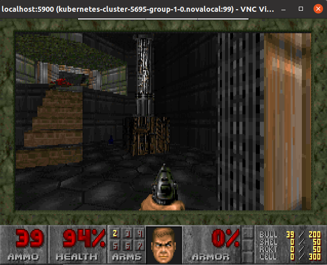

Не совсем понял про количество реплик при обновлении. 
Вроде MaxSurge 0 должно решать проблему, ограничивая количество
запущенных реплик, если я правильно понял
И про рестарты пода, при попытке изменить политику рестартов - он ругается


Но в целом всё заработало



# Домашнее задание для к уроку 3 - Введение в Kubernetes

Cоздайте namespace kubedoom
```
kubectl create ns kubedoom
```

Напишите deployment для запуска игры **Kube DOOM**.

Приложение должно запускаться из образа
```
storaxdev/kubedoom:0.5.0
```
Должен быть описан порт:
```
5900 TCP
```
Для указания протокола используется поле protocol в описании порта.

В деплойменте должна быть одна реплика, при этом при обновлении образа не должно одновременно работать две реплики (см. **maxSurge** и **maxUnavailable** из лекции).

Добавьте в шаблон контейнера параметры
```
hostNetwork: true
serviceAccountName: kubedoom
```

Запустите получившийся деплоймент в кластере Kubernetes в **namespace kubedoom**.
Pod не должен самопроизвольно рестартовать.

В случае возникновения проблем смотрите в описание Pod, ReplicaSet, Deployment.
Например:
```
kubectl describe pod <pod name>
kubectl logs pod <pod name>
```

Разверните в кластере манифест:
```
apiVersion: v1
kind: ServiceAccount
metadata:
  name: kubedoom
  namespace: kubedoom
---
apiVersion: rbac.authorization.k8s.io/v1
kind: ClusterRoleBinding
metadata:
  name: kubedoom
roleRef:
  apiGroup: rbac.authorization.k8s.io
  kind: ClusterRole
  name: cluster-admin
subjects:
  - kind: ServiceAccount
    name: kubedoom
    namespace: kubedoom
```

Этот манифест создаст в кластере сервисную учетную запись и даст ей права Cluster-admin

Для подключения к игре вам нужно выполнить **kubectl portforward** и используйте VNC клиент. Пароль для подключения - **idbehold**

Сохраните манифесты в любом публичном Git репозитории, например GitHub, и пришлите ссылку на репозиторий.

Желаю удачи!

