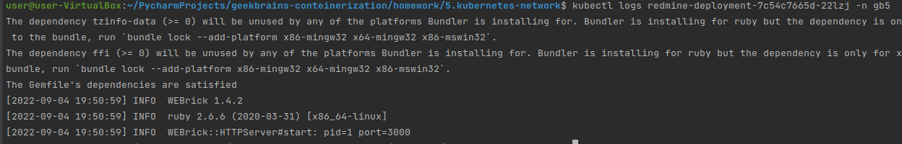

## REDMINE_DB_PASSWORD через секрет
У меня не получилось передать значение REDMINE_DB_PASSWORD через секрет
в деплойменте redmine. Под забирает значение, но дб отказывает в подключении

контейнер принял значение

логи

при передаче значения напрямую всё работает

переменная таже

логи

результат

ингресс

сайт

# Домашнее задание для к уроку 5 - Сетевые абстракции Kubernetes

* Разверните в кластере сервер базы данных Postgresql. Из предыдущего задания.

* Добавьте к нему service c портом 5432 и именем database.

* В этом же неймспэйсе создайте deployment с образом redmine:4.1.1

Для запуска нужно передать переменные окружения:

REDMINE_DB_POSTGRES = database
REDMINE_DB_USERNAME = <postgres_user>
REDMINE_DB_PASSWORD = <postgres_password> (значение должно браться из секрета)
REDMINE_DB_DATABASE = <postgres_database>
REDMINE_SECRET_KEY_BASE = supersecretkey (значение должно браться из секрета)

> Обратите внимание что имя пользователя, пароль и база данных должны соответствовать
> значениям которые указаны в переменных окружения деплоймента postgresql

В деплойменте приложения должен быть описан порт 3000

* Создайте serivce для приложения с портом 3000

* Создайте ingress для приложения, так чтобы запросы с любым доменом на белый IP
вашего сервиса nginx-ingress-controller (тот что в нэймспэйсе ingress-nginx с типом LoadBalancer)
шли на приложение

* Проверьте что при обращении из браузера на белый IP вы видите открывшееся
приложение Redmine (https://www.redmine.org/)
